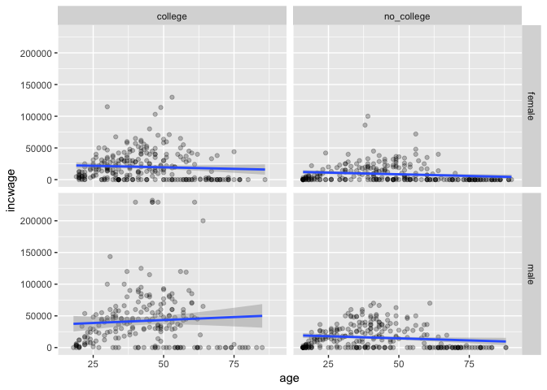

summary\_of\_session\_2
================

As always, we started by loading in the tidyverse.

``` r
library(tidyverse)
```

# Reading in the data

The cps data we aim to analyze is a dta file. We weren’t quite sure how
to read that in so we googled read in stata files into r and then added
“hadley” to the search and filtered to only see results in the last 1
year.

We found our solution in the `haven` package:

``` r
library(haven)

cps <- read_dta(here::here("data-raw", "cps_mar_2000_new with additional vars.dta"))
```

We also noticed that there is a way to look at the variable labels:

``` r
print_labels(cps$sex)
```

    ## 
    ## Labels:
    ##  value  label
    ##      1   Male
    ##      2 Female

# Cleaning the data

We played around with cleaning the data and eventually arrived at the
following:

``` r
cps_new <-
    cps %>%
    sample_frac(0.01) %>%
    select(incwage, age, sex, yrsed) %>%
    mutate(
        sex = case_when(sex == 1 ~ "male", sex == 2 ~ "female"),
        college = case_when(yrsed >= 13 ~ "college", yrsed <= 12 ~ "no_college")
    ) %>%
    filter(age >= 16)
```

# Plotting the data

We walked through building the following plot:

``` r
cps_new %>%
    ggplot(aes(x = age, y = incwage)) +
    geom_point(alpha = 0.25) +
    facet_grid(sex ~ college) +
    geom_smooth(method = "lm")
```

    ## Don't know how to automatically pick scale for object of type haven_labelled. Defaulting to continuous.

<!-- -->

# Modeling the data

Lastly, we built a linear model

``` r
mod <- lm(incwage ~ age + college + sex, data = cps_new)
```

Then we looked at the model using the old way with `summary`.

``` r
summary(mod)
```

    ## 
    ## Call:
    ## lm(formula = incwage ~ age + college + sex, data = cps_new)
    ## 
    ## Residuals:
    ##    Min     1Q Median     3Q    Max 
    ## -38854 -18088  -4001  10139 194789 
    ## 
    ## Coefficients:
    ##                    Estimate Std. Error t value Pr(>|t|)    
    ## (Intercept)        25682.59    2585.68   9.933  < 2e-16 ***
    ## age                  -46.59      48.30  -0.965    0.335    
    ## collegeno_college -18466.33    1710.07 -10.799  < 2e-16 ***
    ## sexmale            14010.21    1713.97   8.174  8.9e-16 ***
    ## ---
    ## Signif. codes:  0 '***' 0.001 '**' 0.01 '*' 0.05 '.' 0.1 ' ' 1
    ## 
    ## Residual standard error: 27060 on 1006 degrees of freedom
    ## Multiple R-squared:  0.1499, Adjusted R-squared:  0.1474 
    ## F-statistic: 59.14 on 3 and 1006 DF,  p-value: < 2.2e-16

And a newer way using the `broom` package.

``` r
library(broom)

tidy(mod)
```

    ## # A tibble: 4 x 5
    ##   term              estimate std.error statistic  p.value
    ##   <chr>                <dbl>     <dbl>     <dbl>    <dbl>
    ## 1 (Intercept)        25683.     2586.      9.93  3.05e-22
    ## 2 age                  -46.6      48.3    -0.965 3.35e- 1
    ## 3 collegeno_college -18466.     1710.    -10.8   8.52e-26
    ## 4 sexmale            14010.     1714.      8.17  8.90e-16

We noticed that the tidy function returns a data frame which we know how
to work with:

``` r
tidy(mod) %>%
    filter(p.value <= 0.05)
```

    ## # A tibble: 3 x 5
    ##   term              estimate std.error statistic  p.value
    ##   <chr>                <dbl>     <dbl>     <dbl>    <dbl>
    ## 1 (Intercept)         25683.     2586.      9.93 3.05e-22
    ## 2 collegeno_college  -18466.     1710.    -10.8  8.52e-26
    ## 3 sexmale             14010.     1714.      8.17 8.90e-16

Lastly, we used the `modelr` package to show how to use the model to add
predictions and residuals to our data:

``` r
library(modelr)

cps_new %>%
    add_predictions(mod) %>%
    add_residuals(mod)
```

    ## # A tibble: 1,010 x 7
    ##    incwage age       sex    yrsed college      pred   resid
    ##      <dbl> <dbl+lbl> <chr>  <dbl> <chr>       <dbl>   <dbl>
    ##  1   15000 33        male    17   college    38155. -23155.
    ##  2       0 83        female  12   no_college  3349.  -3349.
    ##  3       0 16        female   9   no_college  6471.  -6471.
    ##  4   62950 49        male    12   no_college 18943.  44007.
    ##  5       0 89        female   6.5 no_college  3070.  -3070.
    ##  6    7770 33        female  14   college    24145. -16375.
    ##  7   16000 30        female  17   college    24285.  -8285.
    ##  8       0 17        male    10   no_college 20434. -20434.
    ##  9       0 60        male    12   no_college 18431. -18431.
    ## 10   10000 51        female  12   no_college  4840.   5160.
    ## # … with 1,000 more rows
